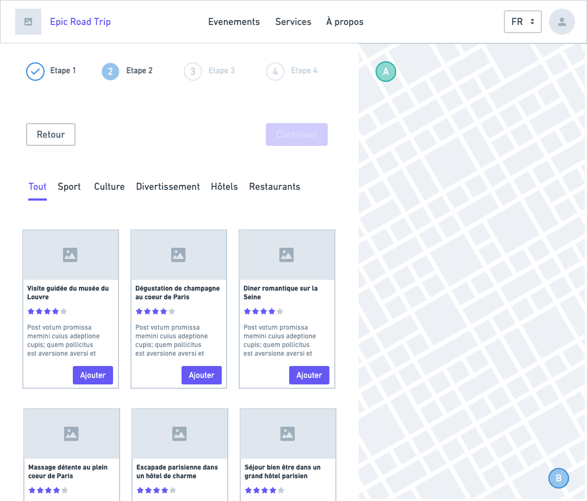

# Epic Road Trip

### Objectif

Je peux plannifier mon prochaine road trip. J'ai juste à entré mon point de départ et mon point d'arrivée, et je peux compléter les différentes étapes de mon trajet en ajoutant des activités qui vont jaloner mon parcours. 

Pour simplifier les user stories: 

> Road Trip = Trajet + Activités + Services

> Etape = Activité ou Service

### Les différentes étapes de l'expérience 

+ Phase 1: Selection du point de départ et d'arrivée du road trip
+ Phase 2: Selection des différentes étapes du road trip
+ Phase 3: Organisation et édition des étapes du road trip
+ Phase 4: Validation du road trip 

## Phase 1: Selection du point de départ et d'arrivée du road trip

### User stories 

+ Je peux ajouter un point de départ à mon Road Trip
+ Je peux ajouter un point d'arrivé à mon Road Trip
+ Je peux voir mon Road Trip dessiné sur une map

## Phase 2: Selection des différentes étapes du road trip

+ Je peux voir une selection d'étape
+ Je peux trier la selection d'étape selon différents filtres
+ Je peux séléctionner une étape pour l'ajouter à mon Road Trip 
+ Je peux voir le dessin de mon Road Trip se mettre à jour en ajoutant une étape
+ Je peux voir parmis la sélection celle que j'ai ajoutée
+ Je peux déselectionner une étape pour la supprimer de mon Road Trip 
+ Je peux voir le dessin de mon Road Trip se mettre à jour en supprimant une étape
+ Je peux cliquer une étape pour en voir le détail 

## Phase 3: Organisation et édition des étapes du road trip 

+ Je peux supprimer une étape de mon road trip 
+ Je peux modifier l'ordre des étapes de mon road trip
+ Le peux cliquer une étape pour voir le détail de celle ci

## Phase 4: Validation du road trip 

+ Je peux voir la fiche détaillée de mon road trip 
+ Je peux voir le budget total de mon road trip 
+ Je peux valider mon road trip 
+ Je peux obtenir le détail de mon road trip au format PDF 
+ Je peux imprimer le détail de mon road trip

## WIREFRAME

Lien du wireframe: https://whimsical.com/epic-road-trop-SHLpCS1GKCVRYBRWBc1mNb

### Home page

## Étapes

L'expérience va être découpée en plusieurs étapes

## Étape 1

## Étape 2

